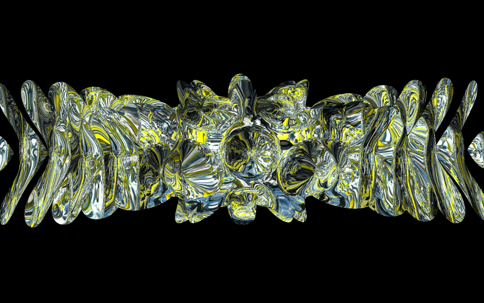

This repository contains the visuals used for the video ["I Am Mensch"](https://www.youtube.com/watch?v=p_qtiPz5bUw), by Zeta Reticula&Helga Neuer, distribuited by the electronic music label Mechatronica.

## credits
The structure of the application and the usage of `ofxLayer`, `ofxAnimationPrimitives` and `ofxGlobalContext` comes from [Yuma Taesu, Live](https://github.com/yumataesu/Live).
